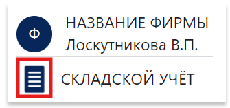

# Тестовое задание

Меню адаптировано под мобильные устройства, сворачивание меню происходит через иконку в блоке.



Проект доступен на github-pages: https://yanokk.github.io/checkport-test/

## Запуск через докер

```sh
docker build -t checkport-test .
```

```sh
docker run --rm --name checkport-test --env VITE_API=https://testjob.checkport.ru/ --env VITE_BASE=/checkport-test -p 3000:8000 -d checkport-test
```

## Локальный запуск

```sh
npm install
npm run dev
```

```sh
npm run dev
```